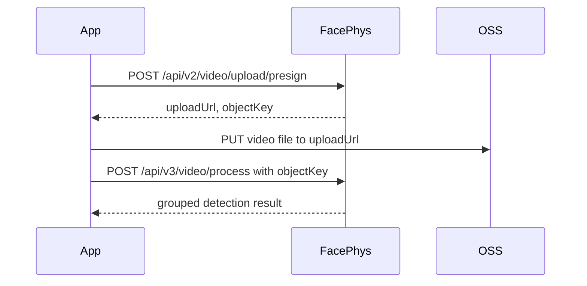

# FacePhys SDK Usage Guide

[English](sdk-usage.md) | [简体中文](sdk-usage.zh-CN.md)

This guide explains how to use the public FacePhys SDK files and how to read the
video detection response.

## 1. Authentication

FacePhys authenticated endpoints use HMAC-SHA256 request headers:

| Header | Description |
| --- | --- |
| `x-key-id` | Your FacePhys API Key ID |
| `x-timestamp` | Current Unix timestamp in seconds |
| `x-signature` | Base64 encoded `HMAC-SHA256(secret_key, timestamp)` |

The timestamp is valid for a limited time window, so keep the client clock
synchronized. The SDKs generate these headers automatically.

## 2. Video Requirements

Recommended input:

| Item | Recommendation |
| --- | --- |
| Format | MP4, MOV, AVI, or WebM |
| Duration | 15 to 120 seconds; 30 seconds recommended |
| Resolution | At least 640 x 480 |
| Face area | At least 20% of the frame |
| Capture | Even lighting, no strong backlight, reduced head motion |

For best physiological signal quality, ask the user to face the camera, keep the
eyes, nose, and mouth visible, and avoid sunglasses, masks, strong expressions,
or rapid movement.

## 3. Python SDK

Copy [`sdks/python/facephys_sdk.py`](../sdks/python/facephys_sdk.py) into your
project and install `requests`:

```bash
pip install requests
```

Example:

```python
from facephys_sdk import FacePhysClient

client = FacePhysClient(
    key_id="your-key-id",
    secret_key="your-secret-key",
    base_url="https://www.facephys.com",
)

result = client.process_video("/path/to/video.mp4")
data = result["data"]
cardiac = data.get("cardiac", data)

print("Heart rate:", cardiac["hr"], "BPM")
print("Signal quality:", cardiac.get("sqi", data.get("confidence")))
```

The Python SDK raises:

| Error | Meaning |
| --- | --- |
| `FileNotFoundError` | The video path does not exist |
| `FacePhysError` | A FacePhys API request or upload step failed |

## 4. JavaScript SDK

Copy [`sdks/javascript/facephys-sdk.js`](../sdks/javascript/facephys-sdk.js) into
your project.

```js
import { FacePhysClient } from './facephys-sdk.js';

const client = new FacePhysClient({
  keyId: 'your-key-id',
  secretKey: 'your-secret-key',
  baseUrl: 'https://www.facephys.com',
  apiVersion: 3,
});

const result = await client.processVideo(file, {
  onProgress: (pct) => console.log(`Upload: ${pct}%`),
});

const cardiac = result.data.cardiac ?? result.data;
console.log('Heart rate:', cardiac.hr);
console.log('Signal quality:', cardiac.sqi ?? result.data.confidence);
```

`file` can be a browser `File` or `Blob`.

Security note: do not embed long-lived `secretKey` values in public frontend
bundles. For production browser applications, keep the secret on your backend
and expose your own minimal proxy endpoint to the browser.

## 5. Java SDK

Copy [`sdks/java/FacePhysClient.java`](../sdks/java/FacePhysClient.java) into
your Java project. It has no external dependencies and requires Java 11+.

```java
public class Demo {
    public static void main(String[] args) {
        FacePhysClient client = new FacePhysClient(
                "your-key-id",
                "your-secret-key",
                "https://www.facephys.com"
        );

        String resultJson = client.processVideo("/path/to/video.mp4");
        System.out.println(resultJson);
    }
}
```

The Java SDK returns the raw JSON response string. Parse it with your preferred
JSON library, such as Jackson, Gson, or your framework's built-in JSON support.

## 6. Go SDK

Copy [`sdks/go/facephys.go`](../sdks/go/facephys.go) into your Go project. It has
no external dependencies and requires Go 1.21+. The file declares `package
facephys`; place it in a `facephys/` directory (or rename the package to match
your own) and import it.

```go
package main

import (
	"context"
	"errors"
	"fmt"
	"log"

	"yourmodule/facephys"
)

func main() {
	client := facephys.New("your-key-id", "your-secret-key")

	result, err := client.ProcessVideo(context.Background(), "/path/to/video.mp4")
	if err != nil {
		var apiErr *facephys.Error
		if errors.As(err, &apiErr) {
			log.Fatalf("api error (status %d): %s", apiErr.StatusCode, apiErr.Message)
		}
		log.Fatal(err)
	}

	if c := result.Data.Cardiac; c != nil {
		fmt.Printf("Heart rate: %.1f BPM\n", c.HR)
		fmt.Printf("Signal quality: %.2f\n", c.SQI)
	}
}
```

`New` accepts options such as `WithBaseURL`, `WithCapability`, `WithTimeout`, and
`WithHTTPClient`. `ProcessVideo` returns a typed `*facephys.Result` whose module
fields (`Cardiac`, `BP`, `SpO2`, ...) are pointers that stay `nil` when a module is
absent; `Result.Raw` holds the complete original JSON for any fields not modeled.
On a failed API call the SDK returns a `*facephys.Error` carrying the HTTP
`StatusCode`.

## 7. SDK Flow

All SDKs use the same flow:



The upload step uses the presigned `uploadUrl` returned by FacePhys. The final
processing request uses the returned `objectKey`.

## 8. Response Shape

The V3 detection endpoint returns grouped JSON. Actual fields depend on the API
key's enabled field set, so integrations should handle optional modules.

For the complete field-by-field reference, see
[`response-fields.md`](response-fields.md).

Example response:

```json
{
  "data": {
    "cardiac": {
      "hr": 74.7,
      "sqi": 0.86,
      "hr_list": [
        { "hr": 73.8, "ts": 0 },
        { "hr": 74.2, "ts": 1 }
      ],
      "hrv": {
        "sdnn": 42.1,
        "rmssd": 36.8,
        "pnn50": 18.5,
        "LF": 512.4,
        "HF": 438.2,
        "LF/HF": 1.17,
        "breathing_rate": 15.6
      }
    },
    "bp": {
      "sbp": 120.1,
      "dbp": 80.2,
      "confidence": 0.36
    },
    "spo2": {
      "spo2": 97.5,
      "confidence": 0.72
    },
    "psych": {
      "stress": 31,
      "relaxation": 68,
      "fatigue": 22,
      "sleep_quality": 74,
      "concentration": 81
    },
    "emotion": {
      "surface": {
        "happy": 0.62,
        "neutral": 0.28
      },
      "deep": {
        "dominant": "calm",
        "confidence": 0.71
      }
    },
    "face_au": {
      "AU01": 0.12,
      "AU12": 0.48
    },
    "behavior": {
      "blink_rate": 14.2,
      "perclos": 0.08,
      "gaze_stability": 0.86
    },
    "appearance": {
      "age": { "value": 29, "confidence": 0.83 },
      "gender": { "label": "Man", "confidence": 0.91 },
      "skin_tone": { "fitzpatrick": "III", "confidence": 0.76 }
    },
    "liveness": {
      "is_live": true,
      "liveness_score": 0.94
    }
  },
  "video_duration": 30.2,
  "message": "success",
  "points_deducted": 280000,
  "remaining_points": 9720000
}
```

Common modules:

| Module | Typical fields | Meaning |
| --- | --- | --- |
| `cardiac` | `hr`, `sqi`, `hr_list`, `hrv` | Heart rate, signal quality, HR sequence, and HRV metrics |
| `cardiac.hrv` | `sdnn`, `rmssd`, `pnn50`, `LF`, `HF`, `LF/HF`, `breathing_rate` | Heart-rate variability indicators |
| `bp` | `sbp`, `dbp`, `confidence` | Estimated systolic and diastolic blood pressure |
| `spo2` | `spo2`, `confidence` | Estimated oxygen saturation |
| `psych` | `stress`, `relaxation`, `fatigue`, `sleep_quality`, `concentration` | Psychological and state scores |
| `emotion` | `surface`, `deep`, `dominant` | Facial expression and deep emotion inference |
| `face_au` | Action-unit values | Facial action unit indicators |
| `behavior` | `blink_rate`, `perclos`, `gaze_stability` | Eye movement, fatigue, and behavior indicators |
| `appearance` | `age`, `gender`, `skin_tone` | Face appearance attributes |
| `liveness` | `is_live`, `liveness_score`, `signals` | Live-face confidence and anti-spoofing signals |

Signal quality guidance:

| `cardiac.sqi` | Suggested interpretation |
| --- | --- |
| `>= 0.30` | Usually reliable |
| `0.15 - 0.30` | Usable as a reference |
| `< 0.15` | Recollect the video if possible |

## 9. Error Handling

Typical HTTP status codes:

| Status | Meaning | Recommended handling |
| --- | --- | --- |
| `400` | Missing parameter, invalid format, or unsupported video | Check request body and video format |
| `401` | Missing auth headers, invalid signature, or timestamp skew | Verify key, secret, signature, and clock sync |
| `403` | Key disabled, expired, insufficient quota, or field set mismatch | Check account status and quota |
| `413` | Video file exceeds upload limits | Reduce file size or use direct upload flow |
| `429` | Rate limit or concurrency limit exceeded | Retry with backoff |
| `500` | Server-side persistence or processing error | Retry later or contact support |
| `503` | Compute nodes temporarily unavailable | Retry with exponential backoff |
| `504` | Processing timeout | Retry with a shorter or higher quality video |

For transient `5xx` errors, retry with exponential backoff, for example 1s,
2s, 4s, and 8s.
