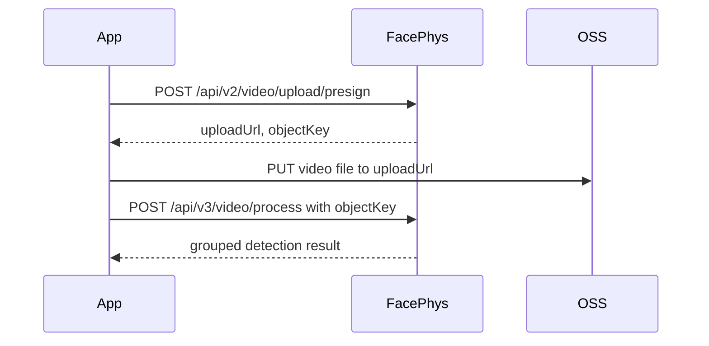

# FacePhys SDK 使用指南

[English](sdk-usage.md) | [简体中文](sdk-usage.zh-CN.md)

本文介绍如何使用 FacePhys 公开 SDK 文件，以及如何读取视频检测返回结果。

## 1. 鉴权

FacePhys 认证接口使用 HMAC-SHA256 请求头：

| Header | 说明 |
| --- | --- |
| `x-key-id` | FacePhys API Key ID |
| `x-timestamp` | 当前 Unix 秒级时间戳 |
| `x-signature` | `HMAC-SHA256(secret_key, timestamp)` 的 Base64 编码结果 |

时间戳只在有限时间窗口内有效，请确保客户端时间准确。SDK 会自动生成这些请求头。

## 2. 视频要求

推荐输入：

| 项目 | 建议 |
| --- | --- |
| 格式 | MP4、MOV、AVI 或 WebM |
| 时长 | 15 到 120 秒，推荐 30 秒 |
| 分辨率 | 不低于 640 x 480 |
| 人脸占比 | 人脸区域至少占画面 20% |
| 采集环境 | 光照均匀，避免强逆光，减少头部运动 |

为获得更好的生理信号质量，建议用户正对摄像头，保持眼睛、鼻子、嘴部可见，避免墨镜、
口罩、夸张表情和快速移动。

## 3. Python SDK

将 [`sdks/python/facephys_sdk.py`](../sdks/python/facephys_sdk.py) 复制到项目中，
并安装 `requests`：

```bash
pip install requests
```

示例：

```python
from facephys_sdk import FacePhysClient

client = FacePhysClient(
    key_id="your-key-id",
    secret_key="your-secret-key",
    base_url="https://www.facephys.com",
)

result = client.process_video("/path/to/video.mp4")
data = result["data"]
cardiac = data.get("cardiac", data)

print("心率:", cardiac["hr"], "BPM")
print("信号质量:", cardiac.get("sqi", data.get("confidence")))
```

Python SDK 可能抛出的异常：

| 异常 | 含义 |
| --- | --- |
| `FileNotFoundError` | 视频路径不存在 |
| `FacePhysError` | FacePhys API 请求或上传步骤失败 |

## 4. JavaScript SDK

将 [`sdks/javascript/facephys-sdk.js`](../sdks/javascript/facephys-sdk.js) 复制到项目中。

```js
import { FacePhysClient } from './facephys-sdk.js';

const client = new FacePhysClient({
  keyId: 'your-key-id',
  secretKey: 'your-secret-key',
  baseUrl: 'https://www.facephys.com',
  apiVersion: 3,
});

const result = await client.processVideo(file, {
  onProgress: (pct) => console.log(`Upload: ${pct}%`),
});

const cardiac = result.data.cardiac ?? result.data;
console.log('Heart rate:', cardiac.hr);
console.log('Signal quality:', cardiac.sqi ?? result.data.confidence);
```

`file` 可以是浏览器中的 `File` 或 `Blob`。

安全提示：不要把长期有效的 `secretKey` 写进公开前端包。生产环境浏览器应用建议把
Secret 保存在自有后端，由后端暴露最小化代理接口给浏览器调用。

## 5. Java SDK

将 [`sdks/java/FacePhysClient.java`](../sdks/java/FacePhysClient.java) 复制到 Java
项目中。该 SDK 无外部依赖，要求 Java 11+。

```java
public class Demo {
    public static void main(String[] args) {
        FacePhysClient client = new FacePhysClient(
                "your-key-id",
                "your-secret-key",
                "https://www.facephys.com"
        );

        String resultJson = client.processVideo("/path/to/video.mp4");
        System.out.println(resultJson);
    }
}
```

Java SDK 返回原始 JSON 字符串。你可以使用 Jackson、Gson 或业务框架内置的 JSON
库进行解析。

## 6. SDK 调用流程

所有 SDK 都使用同一套流程：



上传步骤使用 FacePhys 返回的预签名 `uploadUrl`。最终处理请求使用返回的 `objectKey`。

## 7. 返回结果结构

V3 检测接口返回分组 JSON。实际字段取决于 API Key 开通的字段集，因此接入方应当兼容
部分模块缺失的情况。

完整字段级说明请查看 [`response-fields.zh-CN.md`](response-fields.zh-CN.md)。

示例响应：

```json
{
  "data": {
    "cardiac": {
      "hr": 74.7,
      "sqi": 0.86,
      "hr_list": [
        { "hr": 73.8, "ts": 0 },
        { "hr": 74.2, "ts": 1 }
      ],
      "hrv": {
        "sdnn": 42.1,
        "rmssd": 36.8,
        "pnn50": 18.5,
        "LF": 512.4,
        "HF": 438.2,
        "LF/HF": 1.17,
        "breathing_rate": 15.6
      }
    },
    "bp": {
      "sbp": 120.1,
      "dbp": 80.2,
      "confidence": 0.36
    },
    "spo2": {
      "spo2": 97.5,
      "confidence": 0.72
    },
    "psych": {
      "stress": 31,
      "relaxation": 68,
      "fatigue": 22,
      "sleep_quality": 74,
      "concentration": 81
    },
    "emotion": {
      "surface": {
        "happy": 0.62,
        "neutral": 0.28
      },
      "deep": {
        "dominant": "calm",
        "confidence": 0.71
      }
    },
    "face_au": {
      "AU01": 0.12,
      "AU12": 0.48
    },
    "behavior": {
      "blink_rate": 14.2,
      "perclos": 0.08,
      "gaze_stability": 0.86
    },
    "appearance": {
      "age": { "value": 29, "confidence": 0.83 },
      "gender": { "label": "Man", "confidence": 0.91 },
      "skin_tone": { "fitzpatrick": "III", "confidence": 0.76 }
    },
    "liveness": {
      "is_live": true,
      "liveness_score": 0.94
    }
  },
  "video_duration": 30.2,
  "message": "success",
  "points_deducted": 280000,
  "remaining_points": 9720000
}
```

常见模块：

| 模块 | 常见字段 | 含义 |
| --- | --- | --- |
| `cardiac` | `hr`, `sqi`, `hr_list`, `hrv` | 心率、信号质量、逐秒心率序列和 HRV 指标 |
| `cardiac.hrv` | `sdnn`, `rmssd`, `pnn50`, `LF`, `HF`, `LF/HF`, `breathing_rate` | 心率变异性指标 |
| `bp` | `sbp`, `dbp`, `confidence` | 估算收缩压、舒张压和置信度 |
| `spo2` | `spo2`, `confidence` | 估算血氧饱和度和置信度 |
| `psych` | `stress`, `relaxation`, `fatigue`, `sleep_quality`, `concentration` | 心理状态和生理状态评分 |
| `emotion` | `surface`, `deep`, `dominant` | 表情情绪和深层情绪推断 |
| `face_au` | Action-unit values | 面部动作单元指标 |
| `behavior` | `blink_rate`, `perclos`, `gaze_stability` | 眼动、疲劳和行为指标 |
| `appearance` | `age`, `gender`, `skin_tone` | 人脸外观属性 |
| `liveness` | `is_live`, `liveness_score`, `signals` | 活体置信度和防伪信号 |

信号质量参考：

| `cardiac.sqi` | 建议解释 |
| --- | --- |
| `>= 0.30` | 通常较可靠 |
| `0.15 - 0.30` | 可作为参考 |
| `< 0.15` | 建议重新采集视频 |

## 8. 错误处理

常见 HTTP 状态码：

| 状态码 | 含义 | 建议处理 |
| --- | --- | --- |
| `400` | 参数缺失、格式错误或视频不支持 | 检查请求体和视频格式 |
| `401` | 鉴权头缺失、签名错误或时间戳偏移过大 | 检查 Key、Secret、签名和客户端时间 |
| `403` | Key 被禁用、过期、额度不足或字段集不匹配 | 检查账号状态和额度 |
| `413` | 视频文件超过上传限制 | 压缩文件或使用直传流程 |
| `429` | 触发限流或并发限制 | 使用退避重试 |
| `500` | 服务端持久化或处理错误 | 稍后重试或联系支持 |
| `503` | 计算节点暂时不可用 | 使用指数退避重试 |
| `504` | 处理超时 | 使用更短或质量更高的视频重试 |

对于临时性 `5xx` 错误，建议使用指数退避重试，例如 1s、2s、4s、8s。
